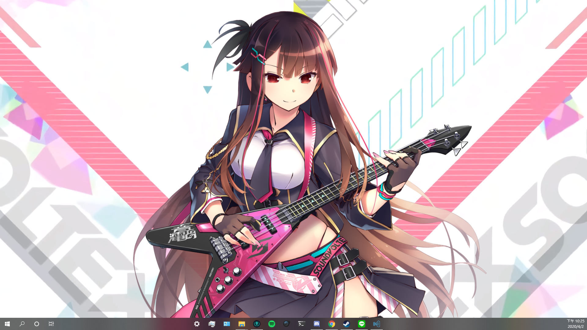

# SDVX Live2D Wallpaper
SDVX Live2D Wallpaper for [Wallpaper Engine](https://store.steampowered.com/app/431960/Wallpaper_Engine/), support all Live2D models from SDVX V 20200115  
  

## Install
- Download repo.
- Download `live2dcubismcore.min.js` from [here](https://www.live2d.com/download/cubism-sdk/download-web/), add put it in `assets/js/`.
- Get your SDVX Live2D models from somewhere, and put them in `assets/live2d/`.
- Download BGM from [here](https://www.youtube.com/watch?v=tBd_QlnYwNg), and put it in `assets/sound/sdvxv.mp3`.
- Get your SDVX `testbg2_fhd.wmv` from somewhere, convert it to webm format and put it in `assets/video/bg.webm`.
- Import folder to Wallpaper Engine. 

## Credits
- `bg2.webm` is taken from [Steam Workshop](https://steamcommunity.com/sharedfiles/filedetails/?id=1940540424)
