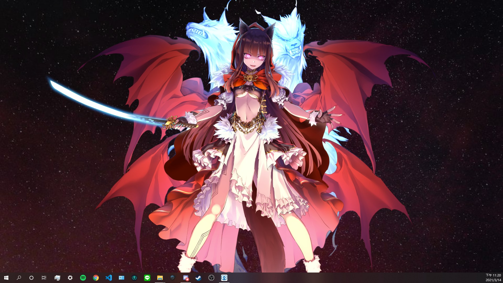
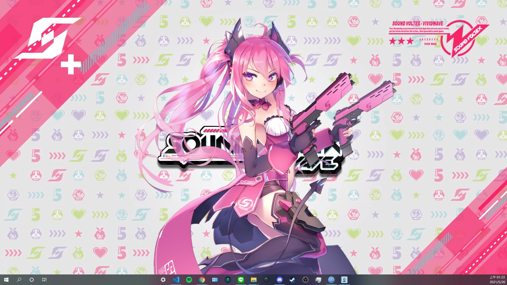

# SDVX Live2D Wallpaper
SDVX Live2D Wallpaper for [Wallpaper Engine](https://store.steampowered.com/app/431960/Wallpaper_Engine/), support all Live2D models from SDVX.
## NOTE: n-0 data is not and will not be supported, once the data is out of n-0 state, there will be plan to be update.
  

## Install
- Download repo.
- Download `live2dcubismcore.min.js` from [here](https://www.live2d.com/download/cubism-sdk/download-web/), and put it in `assets/js/`.
- Get your SDVX Live2D models from somewhere, and put them in `assets/live2d/`.

> [!IMPORTANT]
> For Maxima, if you want the model having the ability to change sunglasses text from `SDVX` to `森一丁`, you may need to manually adding expression files. By setting the correct parameter to 1, the model will change the text. The expression files are not provided, you need to make expression file yourself. This may require proper Live2D license to do so.

> [!IMPORTANT]
> For Hexathalon BPL, you need to manually copy `left_right_hexathlon_bpl` into another folder, and rename the folder to `left_right_hexathlon_bpl_b`, then go into the folder rename the file `left_right_hexathlon_bpl.model3` into `left_right_hexathlon_bpl_b.model3`. Both `left_right_hexathlon_bpl` and `left_right_hexathlon_bpl_b` folder should exist, this is due to the loading system cannot load two models with the same name, as in the model, Left and Right's model is literally using the same model but different attributes.

- Download BGM from [here](https://www.youtube.com/watch?v=tBd_QlnYwNg), or any mp3 you want, put it in `assets/sound/bgm.mp3`.
- Get your SDVX `testbg2_fhd.wmv` from somewhere, or any background video you want, convert it to webm format and put it in `assets/background/bg.webm`.
- Get your favorite SDVX wallpaper image, and put it in `assets/background/bg.jpg`.
- Import folder to Wallpaper Engine. 

### Optional
If you want Aqua to have sound, go get the lines in the game files, and rename the sound you want from orignal name to the following filenames.
- /asset/sound/good.mp3
- /asset/sound/good2.mp3
- /asset/sound/vgood.mp3
- /asset/sound/vgood2.mp3
- /asset/sound/bad.mp3
- /asset/sound/bad2.mp3

You might need to convert the file into mp3 format, as the file originally from the game, this is not provided.

## Features
- Loading model from SDVX.
- Clicking on model gives motion reaction.
- Support X,Y cordinate and size adjustment in Wallpaper Engine.(Some model would be too big or small)
- (BETA) Special Show in game, might have bugs, welcome for opening issues.

> [!WARNING]
> Currently, BPL2 SuddenDeath side hexagon effect is still in progress, so the animation might stuck.

## Future Features
- [x] Precise X,Y,and size adjustment.
- [x] Fix changing models bug.
- [ ] Auto random motions.
- [ ] Allow edit click motion reaction.

## Credits
- Default `bg.webm` is taken from [Steam Workshop](https://steamcommunity.com/sharedfiles/filedetails/?id=1940540424)
- Live2D framework from [pixi-live2d-display](https://github.com/guansss/pixi-live2d-display), if you like this work, don't forget to star this project too!
